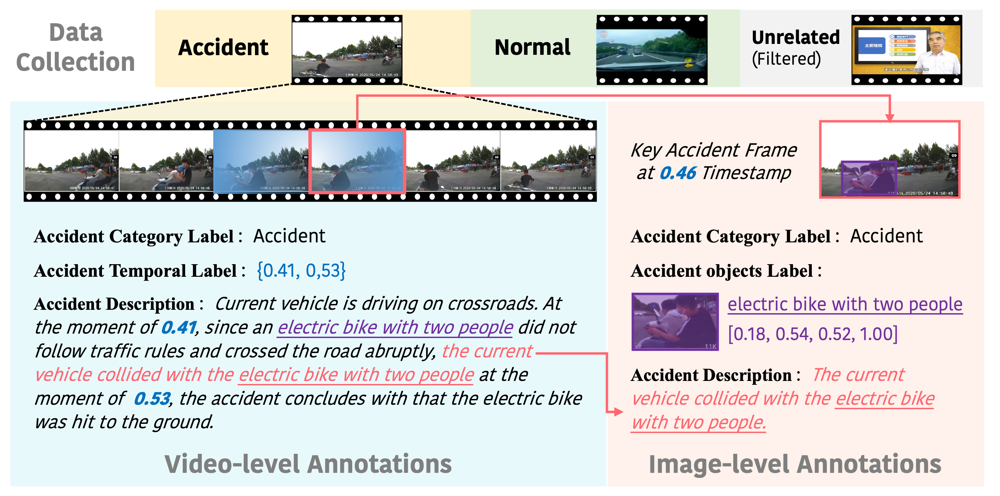

# TABot  
Official codebase for "**TAU-106K**: A New Dataset for Comprehensive Understanding of Traffic Accidents"


## Abstract  
Multimodal Large Language Models (MLLMs) have demonstrated impressive performance in general visual understanding tasks. However, their potential for high-level, fine-grained comprehension, such as anomaly understanding, remains unexplored. Focusing on traffic accidents, a critical and practical scenario within anomaly understanding, we investigate the advanced capabilities of MLLMs and propose TABot, a multimodal MLLM specialized for accident-related tasks. To facilitate this, we first construct TAU-106K, a large-scale multimodal dataset containing 106K traffic accident videos and images collected from academic benchmarks and public platforms. The dataset is meticulously annotated through a video-to-image annotation pipeline to ensure comprehensive and high-quality labels. Building upon TAU-106K, we train TABot using a two-step approach designed to integrate multi-granularity tasks, including accident recognition, spatial-temporal grounding, and an auxiliary description task to enhance the model's understanding of accident elements. Extensive experiments demonstrate TABot's superior performance in traffic accident understanding, highlighting not only its capabilities in high-level anomaly comprehension but also the robustness of the TAU-106K benchmark.


## News
[2025-04-19] Our code are available now!

## Table of Contents  
- [TABot](#tabot)
  - [Abstract](#abstract)
  - [News](#news)
  - [Table of Contents](#table-of-contents)
  - [Quick Start](#quick-start)
    - [Installation](#installation)
    - [Dataset](#dataset)
  - [Model Training](#model-training)
  - [Evaluation](#evaluation)
  - [Acknowledgements](#acknowledgements)
  - [Citation](#citation)
---

## Quick Start

### Installation

To install the required packages, clone the repository and install the dependencies:

```bash
git clone https://github.com/your-org/TABot.git
cd TABot
pip install -r requirements.txt
pip install flash-attn --no-build-isolation
```

### Dataset



Place our TAU-106K dataset in the `data/` directory.
The dataset should be structured as follows:

```
data
├── TAU-106K
├──────images
├──────videos
├──────annotations
├──────────train.json
├──────────test
├─────────────test_image_rd.json
├─────────────test_video_rd.json
├─────────────test_image_sg.json
├─────────────test_video_tl.json
```
Please refer to [data/README.md](data/README.md) for checking the details about generation of the JSON files for training and testing.

---

## Model Training

To train the model, run the following command:

```bash
sh scripts/train.sh
```

---

## Evaluation

To evaluate predictions:

```bash
sh scripts/eval.sh
```

The script computes:

- Accuracy
- Precision, Recall, F1 for accident and normal classes
- Average Precision at IoU thresholds (AP@0.3, AP@0.5, AP@0.7)
- Mean IoU (mIoU)

---
## Acknowledgements
[Grounding-GPT](https://github.com/lzw-lzw/GroundingGPT)\
[Video-LLaMA](https://github.com/DAMO-NLP-SG/Video-LLaMA)

---

## Citation

If you use our code or dataset in your research, please cite:

```bibtex
@inproceedings{zhou2025tau106k,
  title={TAU-106K: A New Dataset for Comprehensive Understanding of Traffic Accident},
  author={Yixuan Zhou, Long Bai, Sijia Cai, Bing Deng, Xing Xu, Heng Tao Shen},
  booktitle={ICLR},
  year={2025}
}
```

